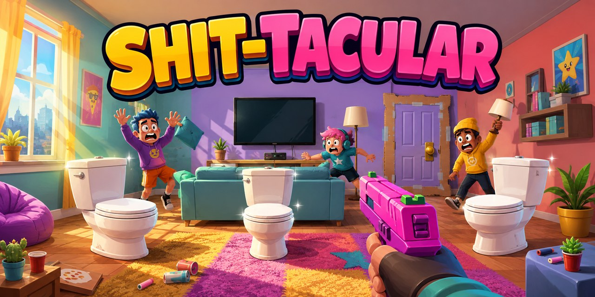

# Shit-Tacular



A first-person, last-player-standing game set inside an apartment. Battle three AI roommates in single-player, or host a direct-IP multiplayer match for 2–8 people.

**[Play Shit-Tacular on GitHub Pages](https://philiphoddinott.github.io/Shit-Tacular/)** · **[View the source on GitHub](https://github.com/PhilipHoddinott/Shit-Tacular)**

> The browser version currently supports single-player. Multiplayer uses ENet over UDP and requires the native desktop version of the game.

## How to play

Choose **basment** (the original apartment) or **2nd floor** (traced from `otherApartmentFloorPlan.jpg`) in the main menu. Each map has its own furniture, spawn points, navigation, and three toilets. Both retain the source floor-plan drawing as their floor. In multiplayer, the host's selected map is loaded on every client when the match starts.

Open `project.godot` in Godot 4.7.2 and press **F6** or **F5**. If you have the prepared Windows playtest folder, you can instead double-click `PLAY_GAME.bat`.

You can also launch the project from PowerShell:

```powershell
.\Godot_v4.7.2-stable_win64.exe\Godot_v4.7.2-stable_win64.exe --path .
```

Choose 1, 2, 3, or 5 **bot lives** from the main menu. Every combatant begins with 100 health. Human players have one life: your death opens a loss screen with **Play Again** and **Main Menu**. Play Again starts a fresh match on the same floor plan with the same bot-lives setting. Bots respawn while lives remain. Multiplayer humans also have one life; death leaves the match, and a host's death closes the session. On the multiplayer loss screen, Play Again opens host/join setup for the next match. The last player standing wins.

Players and bots regenerate **2 health per second after 5 seconds without taking damage**, up to 100 health. Taking another hit restarts the delay. Healing stops on death or when the round ends; multiplayer healing is controlled by the host.

Hold right mouse to zoom while aiming; release it to return to normal view. Rifle zoom is stronger than pistol, shotgun, or bazooka zoom, and mouse sensitivity scales with magnification. Original synthesized spatial effects cover gunfire, impacts, explosions, toilet flushes, weapon rewards, and the rainbow power-up. Sounds are shared with multiplayer peers and require no downloads.

Confirmed hits flash a white hit marker; lethal hits flash gold. Incoming damage flashes the screen edges and shows the attack direction. Weapons have centered aiming sights, subtle movement sway, and recoil. Bots patrol, investigate nearby gunshots, pursue the last place they saw an opponent, and seek reachable cover at low health. Navigation is checked against walls and furniture on the selected map, and defeated bots animate a fall before respawning or remaining eliminated.

Each unique toilet flush awards a random weapon: pistol, shotgun, rifle, or bazooka. Flush all three to trigger **TRIPLE-SHIT!** and lock in the glowing rainbow rifle, which cycles colors and deals 40 damage per bullet for the rest of the round, including after respawning.

## Single-player polish

- **Pause and settings:** Escape opens a real pause menu with Resume, Restart, and Main Menu. Movement, rockets, regeneration, and bot respawn timers freeze. Settings are also available from the main menu: mouse sensitivity, field of view, independent music/SFX volume, and music on/off. Preferences save locally and can be reset to defaults.
- **Rockets:** The bazooka launches a visible rocket with a smoke trail and a cartoon “KA-POOP!” explosion. Direct hits do 90 damage; splash falls off from the target's body center and is blocked by walls. The shooter remains immune to their own blast. Walls also block toilet/chair interactions.
- **Roommates:** Choose Easy, Normal, or Hard reaction speed, accuracy, and firing cadence. Bots strafe safely and sometimes visit reachable toilets to earn the same weapon rewards as you. Their toilet progress and weapons survive respawning. Respawns prefer covered, distant locations; a pulsing cyan ring marks 1.2 seconds of protection during which a bot cannot shoot or take damage.
- **Round progress:** Numbered gold toilet markers turn green after your flushes. The HUD shows remaining enemy lives and elapsed time. Win/loss screens show kills, accuracy, time, and toilets flushed; fastest wins are saved separately for each map/difficulty/bot-lives combination. Accuracy counts trigger pulls that damage an opponent, so multiple shotgun pellets or a rocket multikill count as one successful shot.
- **Apartment:** Added compact cover cabinets, silly signs and trophies, cartoon bot faces, and decor that wobbles near explosions. The floor-plan drawing remains the default. Uncheck **Floor-plan drawing on floor** in Settings for wood/tile finishes; the minimap still shows the plan.

These combat and pause changes target single player; the existing multiplayer protocol and routes have not been redesigned.

## Controls

“Flush Funk,” generated locally with ACE-Step, plays quietly across menus and matches.
Press **M** to pause or resume the music independently of game sound effects.

The bottom-left minimap shows the selected floor plan. Your cyan arrow indicates your position and facing direction; red dots show all other living players or bots, including through walls. Eliminated combatants disappear, and respawning bots reappear. In single player, gold numbered toilet markers turn green as you flush them.

| Control | Action |
| --- | --- |
| `WASD` | Move |
| `Shift` | Sprint |
| `Space` | Jump |
| Left mouse | Fire the equipped weapon |
| Hold right mouse | Aim / zoom (stronger magnification for rifles) |
| `E` | Flush a toilet, sit in a dining chair, or stand up |
| `Escape` | Pause / resume single player; release or recapture the mouse in multiplayer |
| `R` | Restart after the round ends |

## Multiplayer playtest

All players must use the same native version of the game. One player hosts the match and shares the address shown in the lobby with everyone else.

### Host a match

1. Open **Multiplayer** and enter your player name.
2. Choose the total number of human players, from 2–8.
3. For an internet match, leave **Automatically open the UDP port** enabled.
4. Select **Create Lobby**.
5. Use **Copy LAN** for players on the same network, or **Copy Internet** for remote players, then send the copied `IP:port` address to them.
6. When everyone has joined, select **Start Match**.

### Join a match

1. Open **Multiplayer** and enter your player name.
2. Paste the host's complete `IP:port` address into **Host IP**.
3. Select **Join** and wait in the lobby for the host to start the match.

### Connection notes

- Multiplayer uses ENet over UDP. The default port is `7000`.
- **Copy LAN** is for computers on the same Wi-Fi or wired network.
- **Copy Internet** becomes available after the host's router accepts the automatic UPnP port mapping.
- If automatic setup fails, allow the game through the host computer's firewall and manually forward the selected **UDP** port to that computer.
- Some double-NAT and carrier-grade NAT connections cannot accept direct connections. Those networks will need a VPN-style workaround or the planned relay service.

The host is authoritative: clients send their controls to the host, and the host resolves movement, shots, damage, lives, respawns, and the winner. Game state is synchronized back to clients 20 times per second.

## Playtest logs

The Windows build keeps the current session log and up to ten older logs. They include Godot and system information along with important game, lobby, connection, UPnP, death, respawn, and round events.

After a crash or connection problem:

1. Restart the game.
2. Select **Open Crash Logs** on the main menu.
3. Send the newest `.log` file to the developer with a short description of what happened.

If the game fails before reaching the menu, run `PLAY_GAME_DIAGNOSTIC.bat` and send the `startup-diagnostic.log` file from the folder it opens. On Windows, the normal log location is `%APPDATA%\Godot\app_userdata\Shit-Tacular\logs`.

Logs may contain player names and network addresses, so review them before sharing outside the playtest group. Native engine crashes may have a limited backtrace without matching debug symbols, but script errors and the gameplay or network events leading up to the failure should still be recorded.

## Project notes

The apartment uses a doubled horizontal footprint for wider rooms and less crowded firefights. The supplied floor-plan PNG is the default floor. It includes room-specific wall colors, wall panels and bathroom wall tiles, baseboards, ceiling trim, doorway casings, ceiling fixtures, fabric upholstery, detailed cabinets, furniture and small decor, fake window light, a wall-mounted television, four sittable dining chairs, and a very judgmental bathroom mirror. Furniture and wall surface textures are generated deterministically in Godot, with mipmaps, and require no asset downloads. Use `--qa-floorplan-capture` for the overhead layout check.

The GitHub-ready 1280×640 social preview is stored at `assets/github/social-preview.jpg`, with its full-resolution generated source beside it.

## Roadmap

1. Playtest and tune the host-authoritative ENet multiplayer prototype.
2. Improve art, sound, bot navigation, and round presentation.
3. Add room codes, NAT traversal/relay support, and clearer connection diagnostics.
4. Package Windows builds for wider playtesting.

## Single-player checks

With the Godot executable on your PATH, run these from the project directory. They do not connect to multiplayer services:

```text
godot --headless --path . --quit-after 1800 -- --qa-singleplayer
godot --headless --path . --quit-after 1800 -- --qa-smoke
godot --headless --path . --quit-after 1800 -- --qa-maps
godot --headless --path . --quit-after 1800 -- --qa-combat
godot --headless --path . --script res://tools/qa_rockets.gd --quit-after 1800
godot --headless --path . --script res://tools/test_bot_singleplayer.gd --quit-after 1800
godot --headless --path . --script res://tools/test_pause_settings.gd --quit-after 3000
godot --headless --path . --script res://tools/test_round_results.gd --quit-after 1800 -- --qa-results-marker
```

Remove `--headless` from the pause-settings test to also check captured-mouse sensitivity and aiming. Rendered menu, pause, floor, bathroom, and results captures can be generated with `godot --path . --script res://tools/capture_singleplayer.gd -- --qa-polish`; images are saved under the ignored `artifacts/` directory. QA runs do not save personal-best records.
